# Database Schema — EazyCapture AI Agent

A modular monolith on PostgreSQL with **two-level multi-tenancy:**

- A **`firm`** is the top-level workspace — one per signup. It owns its users
  and its connected Xero orgs; a firm never sees another firm's data.
- Within a firm, **every tenant-scoped table carries `company_id`** (indexed)
  and every query filters on it — one `company` = one Xero org.

The DB holds four kinds of data:

1. **Firm + identity** — the workspace (`firm`) and its users (`app_user`).
2. **Connection state** — which Xero orgs are connected (`company`).
3. **A mirror of Xero** — invoices, bills, contacts, accounts, etc. synced
   locally so audits read from the DB instead of hitting Xero every time
   (`xero_document` + `xero_sync_state`). Xero stays the source of truth; this
   is a kept-fresh cache.
4. **Audit output + review** — the issues each audit found, run history, and
   the accountant's notes / uploaded evidence.

---

## Relationship map (ASCII)

```
                         ┌─────────────┐
                         │    firm     │  workspace / top-level tenant (one per signup)
                         └──┬───────┬──┘  owns every company + user below it (firm_id FK)
            firm_id  ┌──────┘       └──────┐  firm_id
                     ▼                     ▼
              ┌─────────────┐       ┌─────────────┐
              │   company   │       │  app_user   │  users (RBAC)
              │ one Xero org│       └──────┬──────┘
              └──────┬──────┘              │ user_company_access (N:N: who sees which org)
   ┌───────────┬─────┼─────┬───────────┐  ├─────────────────┐
   ▼           ▼     ▼     ▼           ▼  ▼                 ▼
xero_sync_  xero_   health_ audit_  bank_note/      notification_log (email)
state       document check_  batch   bank_document
(watermark) (mirror) result

 invoice → invoice_line_item   ← seed/demo only (live audit uses xero_document)
```

Everything is scoped first by `firm_id`, then by `company_id`. The five tables
hanging off `company` that matter for the live audit: `xero_sync_state` +
`xero_document` (the Xero mirror), `health_check_result` + `audit_batch` (audit
output), and `bank_note`/`bank_document` (review). The `invoice` tables are
seed-only.

---

## 0. Firm isolation (the workspace model)

Each signup creates a **`firm`** — an isolated workspace — with the signing-up
user as its admin. Everything else hangs off it:

- `app_user.firm_id` — every user belongs to one firm.
- `company.firm_id` — every connected Xero org belongs to one firm.

A firm's admin sees only their firm's orgs and team; a user in Firm A can never
read Firm B's data. Isolation is enforced at two choke points:

- **`get_current_company_id`** (single-org routes) — a company in another firm
  returns **404** (never even confirmed to exist).
- **`allowed_company_ids_for`** (cross-org / panorama views) — returns only the
  caller's firm companies.

`company_id` scoping is the second layer: even within a firm, a "selected"-mode
team member only sees the orgs an admin assigned to them.

> The script-created **super-admin** (`scripts/create_admin`) has no firm and is
> the platform operator — it can reach every firm (support / debugging).

---

## 1. The connection model (how a Xero org maps to a `company`)

```
ONE accountant's OAuth grant ─────────────▶ ONE nango_connection_id
                                                   │  (covers many orgs)
                          ┌────────────────────────┼────────────────────────┐
                          ▼                         ▼                        ▼
                   company (Org A)           company (Org B)          company (Org C)
                   tenant_id = t-A           tenant_id = t-B          tenant_id = t-C
```

- A **`company` row = one Xero organisation.**
- **`nango_connection_id`** = one OAuth grant (one accountant's connection).
  A single connection can reach **many** Xero orgs.
- **`xero_tenant_id`** = the specific org *within* that connection.
- **Natural key = (`nango_connection_id`, `xero_tenant_id`)** — NOT tenant
  alone, because two different accountants can each connect the same client org
  under their own connection.
- We **never store Xero access/refresh tokens** — Nango holds and auto-refreshes
  them. We only keep the `connection_id` + `tenant_id` to address API calls.

---

## 2. Xero OAuth + onboarding flow

```
Frontend                Backend (FastAPI)              Nango cloud            Xero
   │  POST /connect-session/   │                           │                   │
   ├──────────────────────────▶│  mint session token       │                   │
   │                           ├──────────────────────────▶│                   │
   │◀── session token ─────────┤                           │                   │
   │                                                        │                   │
   │  open Nango Connect UI ───────────────────────────────▶  user logs in ───▶│
   │                                                        │  grants access    │
   │                                                        │◀── tokens stored ─┤
   │                                                        │                   │
   │           auth.creation webhook  ──────────────────────┤                   │
   │                            │◀── POST /webhooks/nango ───┘                   │
   │                            │  _handle_auth_creation:                        │
   │                            │   • list every org on the connection           │
   │                            │   • create one `company` per org + link user   │
   │                            │   • kick off initial sync + first audit         │
```

- The Nango `end_user.id` is the **logged-in user's UUID**, so every org they
  bring in is linked to their account (`user_company_access`).
- **Webhook-free fallback:** if the webhook can't reach the backend (e.g. local
  dev), the frontend calls `POST /api/v1/integrations/nango/sync-connections/`
  which does the same thing via the live connection. Idempotent (upserts).

---

## 3. DB-backed sync (the Xero mirror)

Rather than re-fetching the whole ledger on every audit, Xero is mirrored into
the DB and kept fresh incrementally.

```
                 ┌──────────────────┐         ┌─────────────────────────────┐
   Xero ──sync──▶│ xero_sync_state  │         │       xero_document         │
                 │ (watermark per   │         │ raw Xero JSON, one row per  │
                 │  company+entity) │         │ (company, entity, xero_id)  │
                 └──────────────────┘         └─────────────────────────────┘
                          │                                  │
                          │  audit reads (AUDIT_SOURCE=db)    │
                          └──────────────┬───────────────────┘
                                         ▼
                                reshape → run checks → health_check_result
```

- **`xero_sync_state`** — one row per `(company, entity)`. Holds the
  **watermark** (the latest `UpdatedDateUTC` synced). The next sync asks Xero
  only for records changed since then (`If-Modified-Since`).
- **`xero_document`** — the mirrored data. One row per `(company, entity,
  xero_id)`, storing the **raw Xero JSON** verbatim, so the audit reshapes it
  exactly as it would a live payload (the check logic is identical regardless of
  source).
- **Entities synced:** `invoice`, `bank_transaction`, `credit_note`, `contact`,
  `account` (incrementally, via watermark) and `tax_rate`, `payment`,
  `organisation` (small / full-refresh).

---

## 4. ER diagram (Mermaid)

> Renders in GitHub/GitLab/Notion. No GitHub? See **"How to view"** at the bottom.

```mermaid
erDiagram
    firm ||--o{ company : "owns"
    firm ||--o{ app_user : "owns"
    company ||--o{ xero_sync_state : "sync state"
    company ||--o{ xero_document : "mirrored Xero data"
    company ||--o{ health_check_result : "audit findings"
    company ||--o{ audit_batch : "audit runs"
    company ||--o{ bank_note : "review notes"
    company ||--o{ bank_document : "uploaded files"
    company ||--o{ invoice : "seed data"
    company ||--o{ user_company_access : "scoped to"
    invoice ||--o{ invoice_line_item : has
    app_user ||--o{ user_company_access : "assigned"
    app_user ||--o{ notification_log : "sent to"
    firm ||--o{ notification : "activity feed"
    firm ||--o{ excluded_tenant : "removed orgs"
    company ||--o{ score_history : "score snapshots"
    company ||--o{ client_insight_snapshot : "KPI snapshot"

    firm {
        uuid id PK
        text name "workspace name"
        timestamptz created_at
    }

    company {
        uuid id PK
        uuid firm_id FK "owning workspace"
        text name
        text xero_tenant_id "the Xero org"
        text nango_connection_id "the OAuth grant"
        text xero_shortcode "deep-link code"
        boolean is_active
        boolean needs_reconnect "dead Xero grant → reconnect badge"
        jsonb audit_config "disabled rules, excludes, marked-ok…"
        timestamptz created_at
    }

    xero_sync_state {
        uuid id PK
        uuid company_id FK
        varchar entity "invoice | contact | …"
        timestamptz watermark_utc "max UpdatedDateUTC synced"
        timestamptz last_sync_at
        varchar last_status
        int last_record_count
    }

    xero_document {
        uuid id PK
        uuid company_id FK
        varchar entity
        varchar xero_id "InvoiceID / ContactID / …"
        jsonb raw_json "raw Xero object"
        timestamptz updated_date_utc
        timestamptz synced_at
    }

    health_check_result {
        uuid id PK
        uuid company_id FK
        uuid document_id
        varchar document_type
        varchar kind
        varchar status "blocked | passed | …"
        jsonb result "rule_ids, flagged, AI details"
        timestamptz ran_at
    }

    audit_batch {
        uuid id PK
        uuid company_id FK
        varchar status
        int total
        int trapped
        int contacts_total
        jsonb audit_summary
        timestamptz started_at
        timestamptz completed_at
    }

    bank_note {
        uuid id PK
        uuid company_id FK
        varchar account_code
        varchar period_end
        uuid author_user_id
        text body
        jsonb tagged_user_ids
        timestamptz created_at
    }

    bank_document {
        uuid id PK
        uuid company_id FK
        varchar account_code
        varchar period_end
        text filename
        varchar content_type
        int size_bytes
        bytea content "the file bytes"
        timestamptz created_at
    }

    app_user {
        uuid id PK
        uuid firm_id FK "owning workspace"
        text email
        varchar role "admin | team_member"
        varchar company_access_mode "all | selected"
        text nango_connection_id
        timestamptz created_at
    }

    user_company_access {
        uuid id PK
        uuid user_id FK
        uuid company_id FK
    }

    notification_log {
        uuid id PK
        uuid user_id FK
        text recipient_email
        varchar kind
        varchar status
        timestamptz created_at
    }

    invoice {
        uuid id PK
        uuid company_id FK
        text vendor_name
        numeric amount
        varchar status
        varchar type
    }

    invoice_line_item {
        uuid id PK
        uuid invoice_id FK
        numeric line_amount
        varchar account_code
    }

    excluded_tenant {
        uuid id PK
        uuid firm_id FK "firm that removed the org"
        text xero_tenant_id "the removed org"
        text name
        timestamptz created_at
    }

    score_history {
        uuid id PK
        uuid company_id FK
        int health_score "snapshot value"
        timestamptz recorded_at
    }

    notification {
        uuid id PK
        uuid firm_id FK "activity-feed scope"
        text type "invite_sent | org_connected | …"
        text severity "info | warning | …"
        text title
        text detail
        text actor_email
        uuid company_id "loose ref (no FK)"
        timestamptz created_at
    }

    client_insight_snapshot {
        uuid id PK
        uuid company_id FK
        timestamptz computed_at
        varchar status "ok | failed"
        numeric net_profit
        numeric tax_estimate
        numeric cash
        boolean dla_detected
        jsonb payload "full per-KPI payload"
    }
```



---

## 5. Tables by purpose

### Firm / workspace (top-level tenant)
| Table | Purpose |
|---|---|
| `firm` | one workspace, created per signup. Owns its users (`app_user.firm_id`) and connected orgs (`company.firm_id`). The isolation boundary — a firm never sees another firm's data. |

### Tenant + connection
| Table | Purpose |
|---|---|
| `company` | one connected Xero org, owned by a `firm` (`firm_id`). Natural key `(nango_connection_id, xero_tenant_id)`. `audit_config` (JSONB) holds per-org settings — disabled rules, bank-account excludes, marked-ok, manual statement balances. `needs_reconnect` flags a dead Xero grant (drives the "Reconnect" badge). |
| `excluded_tenant` | a Xero org a firm explicitly removed. The shared grant covers every org the user can reach, so this row stops the connect webhook from resurrecting a removed org. Deleting the row ("re-add") lets the org return. |

### Xero mirror (DB-backed sync)
| Table | Purpose |
|---|---|
| `xero_sync_state` | per-`(company, entity)` watermark + last-run metadata. Drives incremental sync. |
| `xero_document` | the mirrored Xero records — raw JSON, one row per `(company, entity, xero_id)`. The audit reads from here. |

### Audit output + review
| Table | Purpose |
|---|---|
| `health_check_result` | **the audit verdicts** — one row per flagged document (its issues bundled in `result.rule_ids`). |
| `audit_batch` | each audit run's status + counters (total, trapped, contacts_total). |
| `bank_note` | accountant's notes on a bank account at a period end (Bank Balance Check). Internal — never sent to Xero. |
| `bank_document` | supporting files (bank statements, spreadsheets) for a bank account at a period end. Bytes stored in-DB. |
| `score_history` | one health-score snapshot per audit run, so the Alerts feed can show a real drop ("60% → 2%"), not just the current number. |

### Identity / RBAC
| Table | Purpose |
|---|---|
| `app_user` | users (admin / team_member), owned by a `firm` (`firm_id`). Holds invite tokens + `company_access_mode`. |
| `user_company_access` | N:N join — which companies each "selected"-mode member can access (within their firm). |

### Notifications
| Table | Purpose |
|---|---|
| `notification` | firm-scoped in-app activity feed — team + access + connect events (invite sent/accepted, access granted, org connected/removed). |
| `notification_log` | every email send + delivery status. |

### Insights (KPI snapshots)
| Table | Purpose |
|---|---|
| `client_insight_snapshot` | one row per company holding pre-computed KPIs (net profit, tax estimate, cash, working capital, DLA flags…), refreshed nightly. Key figures are duplicated out of the `payload` JSONB into columns so a firm-wide rollup can filter without unpacking JSON. Outside the audit path. |

### Legacy / seed
| Table | Purpose |
|---|---|
| `invoice`, `invoice_line_item` | seeded demo data (used when an org has no live Xero connection). The live audit uses `xero_document`. |

---

## 6. Inside `health_check_result` (where the checks land)

One row = one flagged **document**. The columns people confuse:

| Column | Meaning | Example values |
|---|---|---|
| `document_type` | kind of Xero doc | `ACCREC`, `ACCPAY`, `ACCRECCREDIT`, `ACCPAYCREDIT`, `CONTACT` |
| `kind` | **when/where** it was checked (not the issue) | `pre_ledger`, `post_ledger`, `preview` |
| `status` | the verdict | `blocked` (= "trapped"), `passed`, `unavailable`, `skipped` |
| `result` (JSONB) | **the actual issues + AI details** | see below |

The **issue type is not a column** — it lives in `result.rule_ids`:
```json
result = {
  "rule_ids": ["missing_tax", "duplicate_invoice"],   // issue types (array → many per doc)
  "flagged":  [ {"message": "...", "severity": "critical"} ],
  "messages": "Tax code missing — required by Xero. | ...",
  "resolved": false,        // resolution flags live here, not in `status`
  "dismissed": false
}
```

- One document with 2 problems → **1 row**, 2 entries in `result.rule_ids`.
- `resolved` / `dismissed` are **flags inside `result`**, not `status` values.
- Results tie to a run by `company_id` + `ran_at` (there is no `batch_id` FK).

---

## 7. Full column reference (every table)

The complete column list for all 17 tables, grouped by purpose. `id` is always
a UUID primary key generated app-side (`uuid_pk()` helper). Every tenant-scoped
table carries `company_id` (or `firm_id`) — there is **no per-org table or
per-org database**; one shared set of tables, isolated by these columns.

> `Null? = no` means the column is required. `Key`: `PK` = primary key,
> `FK → x.y` = foreign key. "Loose ref" = a UUID pointer with **no** FK
> constraint (kept so the row survives the referenced row's deletion).

### Firm / identity

**`firm`** — a workspace; the top-level tenant (one per signup).

| Column | Type | Null? | Key | Purpose |
|---|---|---|---|---|
| `id` | uuid | no | PK | |
| `name` | text | no | | workspace display name |
| `created_at` | timestamptz | no | | default `now()` |

**`app_user`** (model `User`) — a user; role `admin` or `team_member`.

| Column | Type | Null? | Key | Purpose |
|---|---|---|---|---|
| `id` | uuid | no | PK | |
| `firm_id` | uuid | yes | FK → `firm.id` | owning firm (nullable only for legacy backfilled rows) |
| `email` | text | no | | login email (unique index) |
| `full_name` | text | yes | | |
| `role` | varchar(32) | no | | `admin` \| `team_member` (default `team_member`) |
| `status` | varchar(32) | no | | `invited` \| `active` \| `disabled` (default `invited`) |
| `company_access_mode` | varchar(16) | no | | `all` \| `selected` (default `selected`) |
| `password_hash` | text | yes | | null while still invited |
| `nango_connection_id` | text | yes | | accountant's Nango connection (set on Xero connect) |
| `invite_token` | text | yes | | one-time invite token, cleared once accepted |
| `invite_expires_at` | timestamptz | yes | | invite expiry |
| `invited_by` | uuid | yes | loose ref | who sent the invite |
| `email_status` | varchar(16) | yes | | latest email delivery status (denormalised) |
| `created_at` | timestamptz | no | | |

**`user_company_access`** — N:N join: which orgs a `selected`-mode team member can access.

| Column | Type | Null? | Key | Purpose |
|---|---|---|---|---|
| `id` | uuid | no | PK | |
| `user_id` | uuid | no | FK → `app_user.id` | the gated team member |
| `company_id` | uuid | no | FK → `company.id` | org they can access |
| `created_at` | timestamptz | no | | |

Unique `(user_id, company_id)`. Admins ignore this table (they see every org).

### Tenant + connection

**`company`** — one connected Xero org (the per-org tenant).

| Column | Type | Null? | Key | Purpose |
|---|---|---|---|---|
| `id` | uuid | no | PK | |
| `firm_id` | uuid | yes | FK → `firm.id` | owning firm (nullable only for legacy rows) |
| `name` | text | no | | org name |
| `xero_tenant_id` | text | yes | | the Xero org id |
| `nango_connection_id` | text | yes | | the OAuth grant |
| `xero_shortcode` | text | yes | | org-scoped code for Xero deep-links |
| `is_active` | boolean | no | | app-level active flag (default `true`) |
| `needs_reconnect` | boolean | no | | dead Xero grant → drives the "Reconnect" badge (default `false`) |
| `audit_config` | jsonb | yes | | per-org settings (disabled rules, bank excludes, marked-ok, manual balances) |
| `created_at` | timestamptz | no | | |

Unique **partial** `(firm_id, xero_tenant_id)` where both set — natural key is
(firm, tenant), so a reconnect (new connection_id) still updates the same org.

**`excluded_tenant`** — a Xero org a firm explicitly removed.

| Column | Type | Null? | Key | Purpose |
|---|---|---|---|---|
| `id` | uuid | no | PK | |
| `firm_id` | uuid | yes | FK → `firm.id` | firm that removed the org |
| `xero_tenant_id` | text | no | | the removed org |
| `name` | text | yes | | org name |
| `created_at` | timestamptz | no | | |

Unique partial `(firm_id, xero_tenant_id)`. Stops the shared grant from
resurrecting a removed org; deleting the row ("re-add") lets it return.

### Xero mirror (DB-backed sync)

**`xero_sync_state`** — sync watermark + last-run metadata, per `(company, entity)`.

| Column | Type | Null? | Key | Purpose |
|---|---|---|---|---|
| `id` | uuid | no | PK | |
| `company_id` | uuid | no | FK → `company.id` | tenant scope |
| `entity` | varchar(32) | no | | `invoice` \| `contact` \| … |
| `watermark_utc` | timestamptz | yes | | max `UpdatedDateUTC` synced (null = never → full sync) |
| `last_full_sync_at` | timestamptz | yes | | |
| `last_sync_at` | timestamptz | yes | | |
| `last_status` | varchar(16) | yes | | `ok` \| `error` \| `in_progress` |
| `last_error` | text | yes | | |
| `last_record_count` | integer | no | | rows touched last run (default 0) |
| `created_at` | timestamptz | no | | |
| `updated_at` | timestamptz | no | | auto-updates on write |

Unique `(company_id, entity)`.

**`xero_document`** — one mirrored Xero record, raw JSON.

| Column | Type | Null? | Key | Purpose |
|---|---|---|---|---|
| `id` | uuid | no | PK | |
| `company_id` | uuid | no | FK → `company.id` | tenant scope |
| `entity` | varchar(32) | no | | which entity type |
| `xero_id` | varchar(64) | no | | Xero native id (or natural key for id-less entities) |
| `raw_json` | jsonb | no | | the complete Xero object, verbatim |
| `updated_date_utc` | timestamptz | yes | | parsed `UpdatedDateUTC`; drives watermark + ordering |
| `synced_at` | timestamptz | no | | auto-updates on write |

Unique `(company_id, entity, xero_id)`. Raw JSON (not typed columns) so the
audit reshapes it exactly like a live payload.

### Audit output + review

**`health_check_result`** — one audit verdict per document (see §6 for the `result` JSONB).

| Column | Type | Null? | Key | Purpose |
|---|---|---|---|---|
| `id` | uuid | no | PK | |
| `company_id` | uuid | no | FK → `company.id` | tenant scope |
| `document_id` | uuid | no | loose ref | the audited document |
| `document_type` | varchar(32) | no | | `ACCREC` \| `ACCPAY` \| `CONTACT` \| … |
| `kind` | varchar(32) | no | | `pre_ledger` \| `post_ledger` \| `preview` |
| `status` | varchar(32) | no | | `passed` \| `blocked` \| `unavailable` \| `skipped` |
| `error_msgs` | text | yes | | |
| `result` | jsonb | no | | flagged items + AI details (default `{}`) — issue types live in `result.rule_ids` |
| `ran_at` | timestamptz | no | | |

Indexed heavily: GIN on `result`, plus composite `(company_id, ran_at)`,
`(document_id, ran_at)`, `(company_id, kind, status)`.

**`audit_batch`** — one audit run's status + counters.

| Column | Type | Null? | Key | Purpose |
|---|---|---|---|---|
| `id` | uuid | no | PK | |
| `company_id` | uuid | no | FK → `company.id` | tenant scope |
| `status` | varchar(32) | yes | | `in_progress` \| `completed` \| `failed` |
| `total` | integer | no | | documents audited (default 0) |
| `trapped` | integer | no | | flagged count (default 0) |
| `new_trapped` | integer | no | | newly trapped this run (default 0) |
| `contacts_total` | integer | no | | contacts audited — score denominator (default 0) |
| `audit_summary` | jsonb | yes | | summary payload |
| `ai_enriched_count` | integer | no | | results AI-enriched (default 0) |
| `ai_enrichment_complete` | boolean | no | | enrichment finished? (default `false`) |
| `started_at` | timestamptz | no | | |
| `completed_at` | timestamptz | yes | | |

**`score_history`** — one health-score snapshot per run (so Alerts can show a real drop).

| Column | Type | Null? | Key | Purpose |
|---|---|---|---|---|
| `id` | uuid | no | PK | |
| `company_id` | uuid | no | FK → `company.id` | tenant scope |
| `health_score` | integer | no | | the snapshot value |
| `recorded_at` | timestamptz | no | | indexed with `company_id` |

**`bank_note`** — accountant's note on a bank account at a period end. Internal (never sent to Xero).

| Column | Type | Null? | Key | Purpose |
|---|---|---|---|---|
| `id` | uuid | no | PK | |
| `company_id` | uuid | no | FK → `company.id` | tenant scope |
| `account_code` | varchar(32) | no | | bank account |
| `period_end` | varchar(16) | no | | period the note applies to |
| `author_user_id` | uuid | yes | loose ref | note author |
| `body` | text | no | | note text |
| `tagged_user_ids` | jsonb | yes | | @-tagged user-ids |
| `created_at` | timestamptz | no | | |

Indexed `(company_id, account_code, period_end)`.

**`bank_document`** — supporting file for a bank account at a period end. Bytes in-DB.

| Column | Type | Null? | Key | Purpose |
|---|---|---|---|---|
| `id` | uuid | no | PK | |
| `company_id` | uuid | no | FK → `company.id` | tenant scope |
| `account_code` | varchar(32) | no | | bank account |
| `period_end` | varchar(16) | no | | period the file applies to |
| `filename` | text | no | | |
| `content_type` | varchar(128) | no | | MIME type |
| `size_bytes` | integer | no | | (default 0) |
| `content` | bytea | no | | the file bytes (swap for S3/GCS at scale) |
| `uploaded_by` | uuid | yes | loose ref | uploader |
| `created_at` | timestamptz | no | | |

Indexed `(company_id, account_code, period_end)`.

### Notifications

**`notification`** — firm-scoped in-app activity feed.

| Column | Type | Null? | Key | Purpose |
|---|---|---|---|---|
| `id` | uuid | no | PK | |
| `firm_id` | uuid | yes | FK → `firm.id` | feed scope |
| `type` | text | no | | `invite_sent` \| `invite_accepted` \| `access_granted` \| `org_connected` \| `org_removed` |
| `severity` | text | no | | (default `info`) |
| `title` | text | no | | |
| `detail` | text | yes | | |
| `actor_email` | text | yes | | who triggered it |
| `company_id` | uuid | yes | loose ref | so a removal event survives the org's deletion |
| `created_at` | timestamptz | no | | indexed with `firm_id` |

**`notification_log`** — one row per outbound send; delivery tracking.

| Column | Type | Null? | Key | Purpose |
|---|---|---|---|---|
| `id` | uuid | no | PK | |
| `user_id` | uuid | yes | FK → `app_user.id` (SET NULL) | recipient; log survives user removal |
| `recipient_email` | text | no | | |
| `channel` | varchar(32) | no | | `email` \| `whatsapp` \| … |
| `kind` | varchar(48) | no | | `invite` \| `resend_invite` \| … |
| `status` | varchar(16) | no | | `queued` \| `sent` \| `delivered` \| `bounced` \| `complained` \| `failed` (default `queued`) |
| `provider` | varchar(48) | yes | | sending provider |
| `provider_message_id` | text | yes | | for webhook matching |
| `error` | text | yes | | |
| `created_at` | timestamptz | no | | |
| `updated_at` | timestamptz | no | | provider webhook upgrades status here |

### Insights

**`client_insight_snapshot`** — pre-computed KPIs per company (one current row each).

| Column | Type | Null? | Key | Purpose |
|---|---|---|---|---|
| `id` | uuid | no | PK | |
| `company_id` | uuid | no | FK → `company.id` | tenant scope |
| `computed_at` | timestamptz | no | | when KPIs were computed |
| `status` | varchar(16) | no | | `ok` \| `failed` (default `ok`) |
| `error` | text | yes | | message when computation failed |
| `net_profit` | numeric(16,2) | yes | | ↓ summary columns, mirrored out of `payload` |
| `tax_estimate` | numeric(16,2) | yes | | |
| `cash` | numeric(16,2) | yes | | |
| `cash_coverage` | numeric(10,2) | yes | | |
| `working_capital` | numeric(16,2) | yes | | |
| `working_capital_healthy` | boolean | yes | | |
| `distributable_reserves` | numeric(16,2) | yes | | |
| `net_asset_value` | numeric(16,2) | yes | | |
| `dla_detected` | boolean | yes | | director's loan account detected |
| `dla_overdrawn` | boolean | yes | | director's loan account overdrawn |
| `payload` | jsonb | no | | full per-KPI payload for instant per-org serve (default `{}`) |

Unique `(company_id)` — one current snapshot per org, upserted nightly.

### Legacy / seed

**`invoice`** — an invoice/bill (seed/demo only; the live audit uses `xero_document`).

| Column | Type | Null? | Key | Purpose |
|---|---|---|---|---|
| `id` | uuid | no | PK | |
| `company_id` | uuid | no | FK → `company.id` | tenant scope |
| `invoice_number` | text | yes | | |
| `vendor_name` | text | no | | vendor/contact |
| `amount` | numeric(12,2) | no | | total |
| `amount_paid` | numeric(12,2) | yes | | |
| `amount_due` | numeric(12,2) | yes | | |
| `issue_date` | date | no | | |
| `due_date` | date | yes | | |
| `status` | varchar(32) | no | | `DRAFT` \| `SUBMITTED` \| `AUTHORISED` \| `PAID` \| `VOIDED` \| `DELETED` |
| `type` | varchar(32) | no | | `ACCREC` \| `ACCPAY` \| `ACCRECCREDIT` \| `ACCPAYCREDIT` |
| `tax_code` | varchar(32) | yes | | |
| `account_code` | varchar(32) | yes | | |
| `reference` | text | yes | | |
| `currency_code` | varchar(8) | no | | (default `GBP`) |
| `created_at` | timestamptz | no | | |
| `updated_at` | timestamptz | no | | auto-updates on write |

Indexed `(company_id, status)`.

**`invoice_line_item`** — one line on a seed `invoice`.

| Column | Type | Null? | Key | Purpose |
|---|---|---|---|---|
| `id` | uuid | no | PK | |
| `invoice_id` | uuid | no | FK → `invoice.id` | owning invoice |
| `description` | text | yes | | |
| `quantity` | numeric(12,4) | no | | (default 1) |
| `unit_amount` | numeric(12,2) | yes | | |
| `account_code` | varchar(32) | yes | | |
| `tax_type` | varchar(32) | yes | | |
| `line_amount` | numeric(12,2) | yes | | |

---

## Foreign keys

| From | → To | On delete |
|---|---|---|
| `company.firm_id` | `firm.id` | CASCADE |
| `app_user.firm_id` | `firm.id` | CASCADE |
| `excluded_tenant.firm_id` | `firm.id` | CASCADE |
| `notification.firm_id` | `firm.id` | CASCADE |
| `xero_sync_state.company_id` | `company.id` | CASCADE |
| `xero_document.company_id` | `company.id` | CASCADE |
| `health_check_result.company_id` | `company.id` | CASCADE |
| `audit_batch.company_id` | `company.id` | CASCADE |
| `score_history.company_id` | `company.id` | CASCADE |
| `client_insight_snapshot.company_id` | `company.id` | CASCADE |
| `bank_note.company_id` / `bank_document.company_id` | `company.id` | CASCADE |
| `invoice.company_id` | `company.id` | CASCADE |
| `invoice_line_item.invoice_id` | `invoice.id` | CASCADE |
| `user_company_access.{user_id, company_id}` | `app_user.id` / `company.id` | CASCADE |
| `notification_log.user_id` | `app_user.id` | SET NULL |

Deleting a `company` cascades to all its mirrored data, audit history, notes
and uploads. Deleting a `firm` cascades to all its companies and users.

---

## Design notes

- **Two-level multi-tenancy:** `firm` is the workspace boundary (each signup is
  isolated); within a firm every audit/sync table carries `company_id` (indexed),
  and every query filters on it. Both layers are enforced by tests.
- **Xero is the source of truth; the DB is a kept-fresh mirror** — `xero_document`
  is refreshed incrementally and can always be rebuilt from Xero.
- **Each module owns its own model file**; tables link by name (no cross-module
  Python imports).
- Migrations live in `alembic/versions/` and build the schema incrementally.

---

## How to view the Mermaid diagram (no GitHub needed)
1. **mermaid.live** — paste the ```mermaid``` block above → renders instantly.
2. **VS Code** — install "Markdown Preview Mermaid Support", open this file, Preview.
3. **Notion** — paste into a `/code` block set to "Mermaid".
