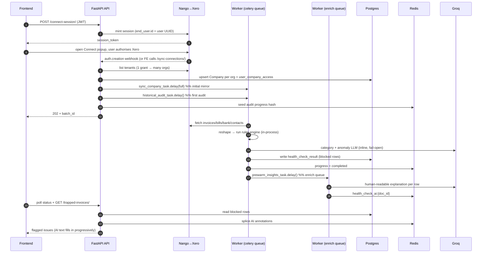

# System Workflow — EazyCapture AI Agent

How the whole thing runs: what boots first, where data comes from, how a
request flows, and how Redis + Celery move the heavy work off the request path.
Read this top-to-bottom once and the codebase stops being a maze.

> Companion docs: **[SCHEMA.md](SCHEMA.md)** (every table + column) and the
> **[run-eazycapture skill](.claude/skills/run-eazycapture/SKILL.md)** (exact
> local launch commands). This file is the *runtime* map; SCHEMA.md is the
> *data* map.

---

## 0. The 30-second mental model

- **One FastAPI app** serves the HTTP API **and runs the rules engine in-process.**
- **Celery workers** do everything slow (Xero sync, the audit, AI enrichment)
  so the API answers in milliseconds and the frontend **polls** for results.
- **Postgres** is the system of record. **Xero** is the ultimate source of truth
  for accounting data; we keep a **kept-fresh mirror** of it in Postgres.
- **Redis** is three things at once: Celery's message broker, Celery's result
  store, and the app's cache + live progress channel.
- **Nango** is the broker that holds Xero's OAuth tokens for us. **Groq** is the LLM.

```
   Browser (React, Django-proxied)
        │  HTTPS  (JWT bearer)
        ▼
┌───────────────────────────────────────────────────────────────┐
│  FastAPI API  (uvicorn :8001)                                  │
│   • auth + firm/company isolation                              │
│   • serves reads (trapped feed, panorama, insights)            │
│   • RUNS THE RULES ENGINE in-process                           │
│   • dispatches slow work → Celery, returns 202 + batch_id      │
└──────┬───────────────┬──────────────────────┬─────────────────┘
       │ SQL           │ enqueue/poll         │ HTTPS
       ▼               ▼                      ▼
  ┌─────────┐    ┌───────────┐         ┌──────────────┐
  │Postgres │    │  Redis    │         │ Nango cloud  │──▶ Xero API
  │ :5434   │    │  :6379    │         │ (OAuth vault)│
  └────▲────┘    │ db0 cache │         └──────────────┘
       │         │ db1 broker│
       │ SQL     │ db2 result│         ┌──────────────┐
       │         └─────▲─────┘         │  Groq (LLM)  │
  ┌────┴───────────────┴────┐          └──────▲───────┘
  │  Celery workers          │─────────────────┘ HTTPS
  │  • worker   (-Q celery)  │  sync + audit
  │  • worker-enrich(-Q enrich)  LLM enrichment (isolated)
  │  • beat  (nightly crons) │
  └──────────────────────────┘
```

---

## 1. What runs, and in what order (boot sequence)

Everything is defined in [docker-compose.yml](docker-compose.yml). The order is
enforced by health-checks + `depends_on`, so a service never starts before its
dependencies are ready.

```
1. postgres   ─ Postgres 17, host :5434 → container :5432   (pg_isready gate)
2. redis      ─ Redis 7, :6379, password-protected          (redis-cli ping gate)
        │  both must report "healthy"
        ▼
3. migrate    ─ ONE-SHOT: `alembic upgrade head`            (depends: pg healthy)
        │  builds/updates the schema, then exits 0
        │  (everything below waits for: service_completed_successfully)
        ▼
4. agent      ─ uvicorn app.main:app :8001   ← the API + rules engine
5. worker     ─ celery worker -Q celery      ← sync + audit
6. worker-enrich ─ celery worker -Q enrich   ← LLM enrichment only
7. beat       ─ celery beat                  ← fires the 3 nightly crons
```

Why this order: the schema must exist before any app process opens a
connection, so `migrate` is a hard gate. Config is loaded **once at import**
([app/core/config.py](app/core/config.py)) and `assert_safe_for_environment`
runs immediately — a bad production env var (auth disabled, weak `JWT_SECRET`,
missing DB URL) **crashes the process at startup**, for every entrypoint (API,
worker, alembic), not lazily.

**Locally** (macOS, via the [Makefile](Makefile)) you run the same pieces by
hand: `make up` (postgres+redis) → `make migrate` → `make api` → `make worker`
→ `make worker-enrich`. Workers use `--pool=solo` on macOS to dodge the
fork-vs-objc crash (audits run serially locally).

---

## 2. Redis & Celery topology (the async backbone)

### Redis is split into three logical databases — on purpose
| DB | Used for | Example keys |
|---|---|---|
| **db0** | app cache + live progress + enrichment write-through | `xero_historical_audit_batch:{batch_id}`, `health_check_ai:{doc_id}`, `xero_coa:{company_id}`, `sync:active:{company_id}` |
| **db1** | **Celery broker** (the task queue) | — |
| **db2** | **Celery result backend** | — |

They are deliberately separate so broker traffic never interleaves with the
app's cache/progress writes. (`REDIS_URL`=db0, `CELERY_BROKER_URL`=db1,
`CELERY_RESULT_BACKEND`=db2 — see [config.py](app/core/config.py#L150-L165).)

### Two Celery queues — because LLM work must not block the ledger
| Queue | Worker service | Tasks |
|---|---|---|
| **`celery`** (default) | `worker` | `healthcheck.historical_audit`, `healthcheck.sync_xero`, `healthcheck.sync_all_xero`, `healthcheck.reconcile_connections`, `insights.refresh_all` |
| **`enrich`** (isolated) | `worker-enrich` | `healthcheck.prewarm_insights`, `healthcheck.reenrich_missing` |

The `enrich` queue exists so a slow / sleep-throttled Groq call can **never
starve** the sync + audit worker. Routing lives in
[celery_app.py](app/core/celery_app.py#L40-L43) (`task_routes`).
Guardrails: `acks_late=True`, `prefetch_multiplier=1`, soft/hard time limits
540s/600s — a stuck upstream call is killed and redelivered rather than wedging
a worker slot forever.

### Three nightly scheduled jobs (Celery beat, UTC)
```
02:00  healthcheck.sync_all_xero      → incrementally pull every org's changes
02:30  insights.refresh_all           → recompute KPI snapshots (off fresh data)
03:00  healthcheck.reconcile_connections → re-enumerate each grant's Xero orgs
```
`beat` only **enqueues**; the default `worker` executes them. No beat process =
no nightly sync/insights/reconcile. (Defined in
[celery_app.py](app/core/celery_app.py#L47-L65).)

### Why two SQLAlchemy engines
The API uses an **async** engine (asyncpg). Celery uses a **sync** engine
(psycopg) because its prefork model doesn't share an asyncio loop. The one
async task (`sync_company_task`) bridges via `asyncio.run` and **disposes the
async pool per task** — a past bug froze the worker after exactly one sync
because pooled connections were bound to an asyncio loop that had already
closed. (See [sync/tasks.py](app/modules/integrations/sync/tasks.py); memory:
`railway-worker-deploy-thrash`.)

---

## 3. The canonical happy path — Connect Xero → issues on screen

This is the spine. Follow these 11 hops and you understand the product. Each
hop names the real function/file and how it hands off to the next.



Hop-by-hop, with the exact code:

| # | Actor | Function / file | What happens | Hands off via |
|---|---|---|---|---|
| 1 | Frontend | `create_connect_session` — [nango/routers.py](app/modules/integrations/nango/routers.py) | User clicks *Connect Xero*; mint a Nango session stamped with the user's UUID as `end_user.id` | HTTP 200 → browser opens Nango popup |
| 2 | Nango + Xero | (external) | User authorises; Nango stores a connection (one grant can reach many orgs) | Webhook **or** frontend `/sync-connections/` |
| 3 | API | `_handle_auth_creation` — [nango/routers.py](app/modules/integrations/nango/routers.py) | Enumerate every org on the grant; skip `excluded_tenant`; **upsert one Company per org** keyed `(firm_id, xero_tenant_id)`; link `user_company_access`; commit | 3 fan-outs below |
| 4 | Worker (`celery`) | `sync_company_task` → `SyncEngine.sync_company` — [sync/engine.py](app/modules/integrations/sync/engine.py) | Initial **full pull** of every Xero entity into the DB mirror | independent; feeds hop 6 if it lands first |
| 5 | API→Celery | `AuditService.dispatch_audit` — [audit_service.py](app/modules/healthcheck/services/audit_service.py) | Insert `audit_batch`, seed Redis progress, enqueue the audit; return `batch_id` in ms | `historical_audit_task.delay()` |
| 6 | Worker (`celery`) | `_fetch_audit_transactions` — [tasks.py](app/modules/healthcheck/tasks.py) | Pick source: **DB mirror** (`AUDIT_SOURCE=db` + synced) → else **live Nango** → else seed. Reshape to the 14-field batch shape; self-heal a stale connection or set `needs_reconnect` | in-process call → hop 7 |
| 7 | Worker (in-proc) | `run_batch_health_check` — [engine/orchestrator.py](app/modules/healthcheck/engine/orchestrator.py) | Run **~20 deterministic checks** + the **inline LLM passes** (category + anomaly) concurrently, fail-open to deterministic | in-process return → hop 8 |
| 8 | Worker (in-proc) | `_persist_trapped` — [tasks.py](app/modules/healthcheck/tasks.py) | One `health_check_result` row per flagged doc (`status=blocked`); finalise `audit_batch` counters; mark progress `completed` | enqueue enrich if new rows |
| 9 | Worker (`enrich`) | `prewarm_insights_task` — [tasks.py](app/modules/healthcheck/tasks.py) | Groq generates a human-readable explanation per row (throttled), on the isolated queue | write-through cache |
| 10 | Worker (`celery`) | `refresh_company_snapshot` — [insights/tasks.py](app/modules/insights/tasks.py) | Recompute the KPI snapshot + append a `score_history` point (drives health-drop alerts) | feeds the notifications feed |
| 11 | Frontend → API | `list_trapped_invoices` — [healthcheck/routers.py](app/modules/healthcheck/routers.py) | Poll status (pure Redis read) until `completed`; poll the trapped feed: one SQL over `health_check_result` + one Redis `MGET` for AI text | **terminal — issues on screen** |

### The two things that surprise everyone
1. **The rules engine runs *inside the Celery worker*, in-process** (`asyncio.run(run_batch_health_check)`), **not over HTTP.** Old docstrings still say "over HTTP" — that hop was removed as fragile. Only *AI enrichment* still crosses a process boundary (the `enrich` queue / Groq).
2. **Initial sync (hop 4) and the audit (hops 6-8) race — there is no ordering.** The audit doesn't wait for the sync: it reads the mirror only if it's ready, otherwise it does its own live Nango fetch. The pipeline is correct either way.

---

## 4. Where the data comes from (ingest)

Accounting data never comes from us — it originates in **Xero**, reached only
through **Nango** (which holds the OAuth tokens). There are two read paths, and
one env var picks between them.

```
                         Xero Accounting API
                                 ▲
                                 │  (tokens held by Nango)
                         ┌───────┴────────┐
                         │   Nango cloud  │
                         └───────┬────────┘
             ┌───────────────────┴───────────────────┐
   AUDIT_SOURCE=db                          live pull (proxy / action)
             │                                       │
             ▼                                       ▼
   ┌──────────────────┐                    ┌────────────────────┐
   │  SYNC ENGINE     │  incremental       │ audit fetches Xero │
   │  writes mirror:  │  (watermark)       │ directly this run  │
   │  xero_document   │◀───────────────    │ (self-heals stale  │
   │  xero_sync_state │                    │  connection id)    │
   └────────┬─────────┘                    └─────────┬──────────┘
            │  db_read.read_documents                │
            └────────────────┬───────────────────────┘
                             ▼
                  reshape → 14-field batch shape
                             ▼
                     RULES ENGINE  (§5)
                             ▼
                    health_check_result
```

- **`AUDIT_SOURCE=db`** (default): the audit reads the **mirror** — instant, no
  Xero round-trip. Gated on `has_synced_documents` (invoice rows exist); if the
  first sync hasn't landed it silently **falls back to a live pull.**
- **Live modes** (`proxy` / `action`): the audit fetches from Xero this run.

### The sync engine (how the mirror stays fresh)
[sync/engine.py](app/modules/integrations/sync/engine.py) mirrors Xero into two
tables via one generic per-entity loop:

- **Incremental** (invoice, bank_transaction, credit_note, contact, account):
  each keeps a **`watermark_utc`** high-water mark; the next run asks Xero only
  for records changed since `watermark − 60s` (the 60s overlap avoids missing a
  same-second edit; the upsert is idempotent so re-seeing is harmless).
- **Full-refresh** (tax_rate, payment, organisation): pulled whole each run and
  **pruned** (rows not seen this run are deleted).
- Raw Xero JSON is upserted page-by-page (`ON CONFLICT` on
  `(company_id, entity, xero_id)`), **commit per page** — a mid-run crash just
  re-pulls from the old watermark, since the watermark only advances at the
  end.
- A `401/403` during a read becomes a `NangoAuthError` → `SyncResult.auth_error`
  → `_update_connection_health` flips **`company.needs_reconnect`** (the
  "Reconnect to Xero" badge). One successful entity clears it.

> **surface_auth gotcha:** POST-based Nango *Actions* would swallow 401/403 to
> an empty list (looks like "no data"). `_action_list_full` passes
> `surface_auth=True` so a dead grant surfaces as an auth error instead. This is
> why a dead connection is now *visible* during DB sync.

---

## 5. The audit pipeline (the core product)

An audit turns raw transactions into flagged issues. Detection is **mostly
deterministic Python**; the LLM adds two checks and the human-readable text.

```
 dispatch ──▶ fetch ──▶ reshape ──▶ [ RULES ENGINE ] ──▶ persist ──▶ enrich
 (202 +      (db/       (14-field    ├─ ~20 deterministic   (blocked   (enrich
  batch_id)   nango/     shape)      │   checks              rows)      queue,
              seed)                  ├─ LLM: wrong_category             async)
                                     └─ LLM: anomaly
                                        (fail-open → deterministic)
```

**Deterministic checks** ([engine/deterministic.py](app/modules/healthcheck/engine/deterministic.py)
+ the `checks/` modules): missing/invalid tax code, missing vendor, missing
invoice number, future-dated, old-unpaid, duplicates, capital-vs-expense,
unexpected account/tax vs contact defaults, wrong ACCREC/ACCPAY direction,
undocumented, direct-payment, etc. Thresholds are per-client-tunable via
`company.audit_config` → `AuditSettings`.

**LLM checks** (only two, gated by `LLM_CHECKS_ENABLED` + `GROQ_API_KEY`):
- **`wrong_category`** — Groq reads the Chart of Accounts and flags miscoded
  lines; kept only at confidence ≥ 0.80, with a hard ACCREC/ACCPAY direction
  guard so cross-ledger suggestions are dropped.
- **`anomaly`** — deterministic amount-outlier detection produces candidates;
  the LLM upgrades genuine ones or drops them. **Any** LLM failure falls back to
  the raw outlier flag, so outliers are never lost.

**Persistence** ([_persist_trapped](app/modules/healthcheck/tasks.py)):
idempotent on `(document_id, company_id, kind=post_ledger, status=blocked)` — an
existing row is re-scored in place and never resurrected if the user marked it
`resolved` / `dismissed` / `marked_ok`. The issue type is **not a column**; it
lives in `result.rule_ids` (see [SCHEMA.md §6](SCHEMA.md)).

**Progress & scoring:**
- Progress lives in the Redis hash `xero_historical_audit_batch:{batch_id}`
  (`_meta` field), **not** Celery's result backend. The frontend polls it
  (`GET …/sync-xero-history-status/{batch_id}/`) or streams it over SSE
  (`GET /api/v1/audit/progress/{batch_id}`).
- The **health score** is computed **live** in the stats endpoint:
  `100 × (1 − open_issues / (MAX audited_documents + MAX contacts_total))`.
  `score_history` snapshots are written by the **insights** task, not the audit.

> **Vestigial columns:** `audit_batch.ai_enriched_count` /
> `ai_enrichment_complete` exist but are never written by the in-repo audit —
> real enrichment progress is derived from Redis in `AuditService.get_status`.

---

## 6. The AI layer (what the LLM actually does)

Honest scope: the LLM (Groq) is used for **exactly four things**. Everything
else is deterministic.

| # | Where | Model | Purpose |
|---|---|---|---|
| 1 | Pre-ledger invoice firewall (`classify_invoice`) | `GROQ_MODEL` | suggest a category for one invoice, only when tax code missing / vendor ambiguous |
| 2 | Audit check `wrong_category` | `GROQ_MODEL` | miscoded-line detection during the audit (inline, default queue) |
| 3 | Audit check `anomaly` | `GROQ_INSIGHT_MODEL` | upgrade amount-outlier candidates to genuine anomalies |
| 4 | Post-audit enrichment (`prewarm_insights`) | `GROQ_INSIGHT_MODEL` | human-readable explanation + severity per flagged row |

Key design points:
- **#2 and #3 run inline** on the audit worker (default queue) — part of
  "checks", they block the audit until done but never crash it: **anomaly**
  falls back to the deterministic amount-outlier flag on LLM failure, while
  **wrong_category** simply contributes nothing (there is no deterministic
  category check) and the rest of the deterministic audit proceeds.
- **#4 runs on the isolated `enrich` queue** — throttled (sleeps between
  batches to stay under Groq's free-tier TPM), writes `health_check_ai:{doc_id}`
  to Redis (~30-day TTL), and the trapped feed splices it in on the next poll
  (eventual consistency). This is why it can never stall the audit.
- **Every LLM call is fail-open:** JSON is parsed tolerantly, exceptions degrade
  to `None`/`[]`/fallback — the model can never hard-block the ledger or audit.
- **Gated in three independent places:** `LLM_CHECKS_ENABLED`, per-rule
  `disabled_rules` in `audit_config`, and `GROQ_API_KEY` presence.

Files: [app/modules/ai/](app/modules/ai/) (client, checks_llm, invoice_categorize,
insight_service, prompts, facts, router, _json).

---

## 7. The request path (auth + multi-tenancy)

This service mints and validates **its own JWTs** (HS256, `JWT_SECRET`) — it
does not trust the main app's tokens. Every request that touches tenant data
passes two isolation choke points.

```
Request (Authorization: Bearer <JWT>)
   │
   ▼  get_current_user  (app/core/auth.py)
   │   • demo mode if AUTH_DISABLED or blank JWT_SECRET → synthetic admin
   │   • else verify HS256 + exp, then RE-CHECK the app_user row every request
   │     (disabled/deleted/role-changed takes effect immediately)
   ▼
   ├─▶ single-company route:  get_current_company_id   (CHOKE POINT 1)
   │      • 404 if company missing/inactive  OR  in another firm (invisible)
   │      • admin / mode=all → allow ; "selected" member → needs assignment else 403
   │
   └─▶ cross-company route:   allowed_company_ids_for  (CHOKE POINT 2)
          • returns the company-id whitelist for the caller's firm
          • None = unrestricted (demo / firm-less super-admin)
   │
   ▼  handler runs, scoped to the validated company_id
      (repositories ALSO put company_id in every WHERE — defence in depth)
```

- **Firm isolation is a 404, not a 403:** a cross-firm company id is reported
  "Unknown company." so its existence is never even confirmed. Only a
  same-firm-but-unassigned team member gets a 403.
- **Not every router is auth-gated:** only `/api/v1/health` and
  `/api/v1/insights` set router-wide auth. The validation / batch (+SSE) /
  enrichment / demo / webhook routers are intentionally open (inspector, demo,
  and HMAC-verified webhook surfaces).
- A cross-tenant leak would need **two** simultaneous bugs (route guard + repo
  scoping). Isolation has been audited clean (0 leaks; memory:
  `multitenancy-isolation-and-perf`).

Files: [main.py](app/main.py), [core/auth.py](app/core/auth.py),
[core/multi_tenant.py](app/core/multi_tenant.py), [core/security.py](app/core/security.py).

---

## 8. Connection lifecycle (why "forget" was tricky)

One accountant's OAuth grant reaches **many** Xero orgs, and Nango's free plan
mints a **new** `connection_id` on every reconnect — so stored ids go stale.
That single fact drives the whole lifecycle design:

| Action | Endpoint | Effect |
|---|---|---|
| **Connect** | webhook / `sync-connections` | one `company` per org, keyed `(firm_id, xero_tenant_id)` |
| **Disconnect** | `POST /disconnect/{id}` | `is_active=False`; grant + synced data kept (no re-OAuth to come back) |
| **Reconnect** | `POST /reconnect/{id}` | `is_active=True` + incremental sync |
| **Remove** | `DELETE /company/{id}?forget=false` | hard delete + insert `excluded_tenant` (stops resurrection) |
| **Forget** | `DELETE /company/{id}?forget=true` | also **revokes the grant via a LIVE connection** so the org returns to Xero's allow-access screen |
| **Re-allow** | `DELETE /excluded-org/{tenant}` | clears the exclusion; org can return |

- **`excluded_tenant`** is essential: because a grant re-enumerates every
  reachable org, without it one reconnect would resurrect every removed org.
- **`forget` must revoke on a live connection:** revoking the stale stored id
  silently no-ops and the org stays greyed "Already connected" — the bug that
  started this whole thread. `revoke_org_grant` scans the firm's live
  connections (firm-scoped) and revokes on whichever holds the tenant.

---

## 9. Config flags that change behaviour

The switches worth knowing (full set in [config.py](app/core/config.py)):

| Flag | Default | Effect |
|---|---|---|
| `APP_ENV` | development | `production` makes the startup safety check fatal (rejects auth-off / weak JWT / missing DB) |
| `AUTH_DISABLED` | false | true (or blank `JWT_SECRET`) → demo mode, synthetic admin, all tenant checks skipped |
| `AUDIT_SOURCE` | `db` | `db` reads the mirror; `proxy`/`action` fetch Xero live |
| `LLM_CHECKS_ENABLED` | true | false → fully deterministic audit (fast); skips category+anomaly + enrichment |
| `HEALTHCHECK_AI_ENABLED` | false | gates the FastAPI enrichment endpoints (separate switch) |
| `GROQ_API_KEY` / `GROQ_MODEL` / `GROQ_INSIGHT_MODEL` | — | LLM creds; empty key disables all LLM work |
| `NANGO_SECRET_KEY` / `NANGO_WEBHOOK_SECRET` | — | Xero-via-Nango; empty secret → connect returns 503; empty webhook secret → HMAC skipped |
| `DATABASE_URL` / `REDIS_URL` / `CELERY_*` | — | Postgres + the 3 Redis dbs |
| `MAX_NANGO_PAGES` | 10 | pagination cap so a bad connection can't page forever |

---

## 10. Quick reference

**Ports:** API `:8001` · Postgres `:5434` (→ container 5432) · Redis `:6379`

**Celery tasks**
| Task name | Queue | Trigger |
|---|---|---|
| `healthcheck.historical_audit` | celery | audit dispatch / auto-audit |
| `healthcheck.sync_xero` | celery | connect / reconnect / Refresh |
| `healthcheck.sync_all_xero` | celery | nightly 02:00 |
| `healthcheck.reconcile_connections` | celery | nightly 03:00 |
| `insights.refresh_all` | celery | nightly 02:30 |
| `healthcheck.prewarm_insights` | **enrich** | after an audit with new trapped rows |
| `healthcheck.reenrich_missing` | **enrich** | backfill missing AI insights |

**Redis keys (db0)**
| Key | Meaning | TTL |
|---|---|---|
| `xero_historical_audit_batch:{batch_id}` | audit progress hash (`_meta`) | short |
| `health_check_ai:{doc_id}` | per-row AI explanation | ~30d |
| `xero_coa:{company_id}` | cached Chart of Accounts | 2h |
| `sync:active:{company_id}` | sync-in-progress flag (Refresh de-dupe) | 300s |

**Key endpoints**
| Endpoint | Does |
|---|---|
| `POST /api/v1/integrations/nango/connect-session/` | start Xero OAuth |
| `POST /api/v1/webhooks/nango` | Nango `auth.creation` → create companies |
| `POST /api/v1/health/sync-xero-history/{company_id}/` | dispatch an audit (→ 202 + batch_id) |
| `GET  /api/v1/health/sync-xero-history-status/{batch_id}/` | poll audit progress (Redis) |
| `GET  /api/v1/audit/progress/{batch_id}` | SSE progress stream |
| `GET  /api/v1/health/trapped-invoices/?company_id=…` | the flagged-issues feed |

**Start here when reading the code**
- Boot/config: [app/core/config.py](app/core/config.py), [app/core/celery_app.py](app/core/celery_app.py), [docker-compose.yml](docker-compose.yml)
- The audit: [app/modules/healthcheck/tasks.py](app/modules/healthcheck/tasks.py) → [engine/orchestrator.py](app/modules/healthcheck/engine/orchestrator.py)
- Sync: [app/modules/integrations/sync/engine.py](app/modules/integrations/sync/engine.py)
- Onboarding: [app/modules/integrations/nango/routers.py](app/modules/integrations/nango/routers.py)
- Auth/tenancy: [app/core/multi_tenant.py](app/core/multi_tenant.py)
